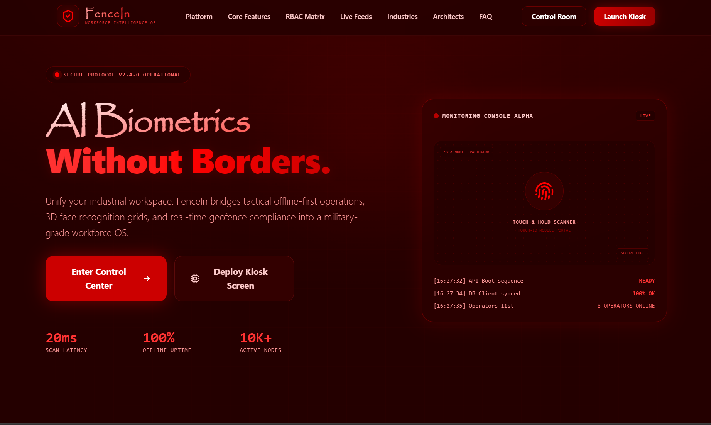

<div align="center">
  <h1>🛡️ FenceIn</h1>
  <p><b>AI-Powered Biometric Workforce Intelligence & Physical Access Control Platform</b></p>

  [](https://www.typescriptlang.org/)
  [](https://nestjs.com/)
  [](https://reactjs.org/)
  [](https://www.postgresql.org/)
</div>

<br />

FenceIn is an enterprise-grade platform designed for industries, factories, warehouses, and construction sites to seamlessly manage permanent employees and temporary contract workers. By combining **facial biometrics, offline-first syncing, and AI-driven analytics**, FenceIn eliminates attendance fraud, automates shift allocations, and provides real-time operational intelligence.

---

## ✨ Enterprise Features

- **Biometric Access Control:** Uses MediaPipe, OpenCV, and InsightFace for highly accurate face detection, liveness validation, and spoof-prevention.
- **Offline-First Resilience:** Designed for harsh industrial environments. Uses IndexedDB and Service Workers to encrypt and queue attendance logs when offline, automatically syncing via background processes when connectivity returns.
- **Contractor & Vendor Management:** Dedicated workflows for vendor workforce submission, supervisor approvals, and temporary access generation.
- **Shift Intelligence Engine:** Grace periods, rotating shifts, weekend rules, and automated overtime calculations.
- **Incident & Audit Systems:** Granular tracking of system modifications, geofence violations, spoofing attempts, and late arrivals mapped against security severity levels.
- **Real-Time Access Monitoring:** WebSocket-powered dashboards for live gate activity feeds, security alerts, and attendance streams.
- **AI Intelligence Layer:** Powered by Groq LLMs to analyze attendance trends, predict absenteeism, and provide conversational administrative insights.

---

## 🏗️ Architecture & Tech Stack

FenceIn utilizes a highly scalable, decoupled architecture designed for multi-tenant deployments and edge processing.

### 💻 Frontend (PWA Kiosk & Dashboard)
- **Framework:** React 19 + Vite + TypeScript
- **State & Data:** Zustand, TanStack Query
- **Styling:** Tailwind CSS, Framer Motion

### ⚙️ Backend (API Gateway & Microservices)
- **Framework:** NestJS
- **Database & ORM:** PostgreSQL (Primary), Prisma ORM, MongoDB (Analytics)
- **Vector Search:** `pgvector` for instant face embedding similarity matching
- **Job Queues:** Redis + BullMQ for async reporting and sync processing

### 🧠 Biometrics & AI
- **Face Processing:** MediaPipe (Liveness), OpenCV, InsightFace/ArcFace (Embeddings)
- **Analytics:** Groq API

### 🛡️ Enterprise Security
- **Auth:** JWT, RBAC (7-tier hierarchy from Super Admin to Worker)
- **Monitoring:** Sentry (Error Tracking), Prometheus & Grafana (System Metrics)
- **Data Protection:** AES-GCM Encrypted offline storage, Helmet.js, Signed Uploads

---

## 🚀 Getting Started

### Prerequisites
- Node.js (v20+)
- PostgreSQL (with `pgvector` extension enabled)
- Redis

### 1. Clone the repository
```bash
git clone https://github.com/OrionGD/FenceIN.git
cd FenceIN
```

### 2. Backend Setup
```bash
cd backend
npm install

# Setup Environment Variables
cp .env.example .env

# Database Setup
npx prisma generate
npx prisma db push

# Start the server
npm run dev
```

### 3. Frontend Setup
```bash
cd frontend
npm install

# Setup Environment Variables
cp .env.example .env.local

# Start the application
npm run dev
```

---

## 📂 Project Structure

```text
FenceIN/
├── backend/                  # NestJS API Gateway & Services
│   ├── src/
│   │   ├── attendance/       # Check-in/out, Geofencing, Trust Engine
│   │   ├── auth/             # JWT, RBAC, Sessions
│   │   ├── biometrics/       # Embedding Matcher, Liveness validation
│   │   ├── common/           # Standard API Interceptors, DTOs, Filters
│   │   └── ...
│   └── prisma/               # Schema and Migrations
└── frontend/                 # React 19 PWA
    ├── src/
    │   ├── components/       # Reusable UI & Dashboards
    │   ├── hooks/            # Offline Sync, Geolocation
    │   ├── pages/            # KioskMode, LandingPage, Analytics
    │   └── store/            # Zustand state
```

---

## 👥 Role Hierarchy

FenceIn strictly isolates data and permissions across 7 hierarchical tiers:  
`Super Admin` ➔ `Organization Admin` ➔ `HR Admin` ➔ `Workforce Supervisor` ➔ `Security Officer` ➔ `Vendor Manager` ➔ `Contractor / Worker`

### 🔑 Demo Login Credentials (Local Development)

The database is seeded with the following default accounts for testing:

| Role | Email | Password |
| :--- | :--- | :--- |
| **Super Admin** | `superadmin@fencein.app` | `admin123` |
| **Organization Admin** | `orgadmin@fencein.app` | `admin123` |
| **HR Admin** | `hr@fencein.app` | `admin123` |
| **Workforce Supervisor** | `supervisor@fencein.app` | `admin123` |
| **Security Officer** | `security@fencein.app` | `admin123` |
| **Vendor Manager** | `vendor@fencein.app` | `admin123` |
| **Contractor / Worker** | `worker@fencein.app` | `admin123` |

> **Note:** These credentials should be changed in a production environment.

### 🛡️ Role Features & Capabilities

Each role comes with specific permissions tailored for industrial workforce management:

1. **Super Admin**: Full system access. Manages Organizations, handles infrastructure settings, views global AI analytics, and monitors system-wide audit logs.
2. **Organization Admin**: Manages their specific enterprise. Configures sites, geofences, shift rules, and oversees organization-wide reporting and compliance.
3. **HR Admin**: Handles payroll exports, audits overall attendance, resolves shift anomalies, and manages permanent employee onboarding and policies.
4. **Workforce Supervisor**: Manages specific sites or teams. Approves timesheets, handles manual attendance overrides, and monitors real-time shift adherence.
5. **Security Officer**: Monitors real-time access kiosk feeds. Receives instant alerts for spoofing attempts, geofence violations, and manages incident reports.
6. **Vendor Manager**: (External Role) Submits contractor rosters, manages vendor worker credentials, and tracks attendance exclusively for their own workers.
7. **Contractor / Worker**: Personal access to view their own attendance logs, upcoming shifts, and individual compliance/trust scores.

---

<div align="center">
  <p>Built for the modern industrial workforce. 🏭</p>
</div>
