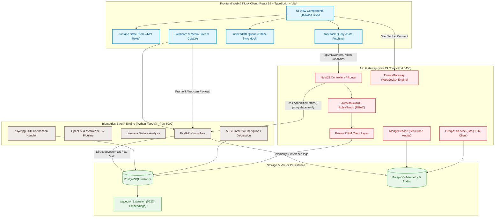
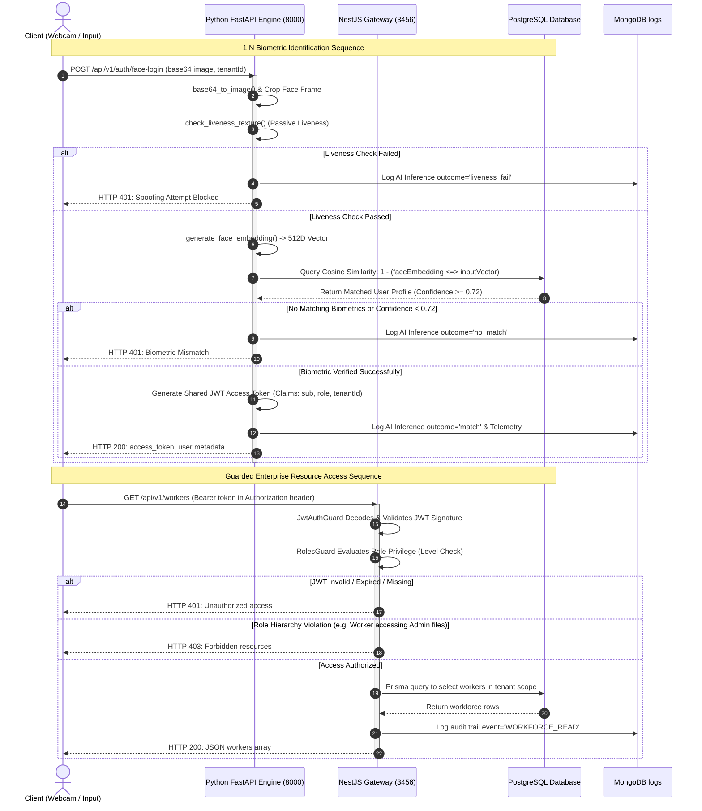
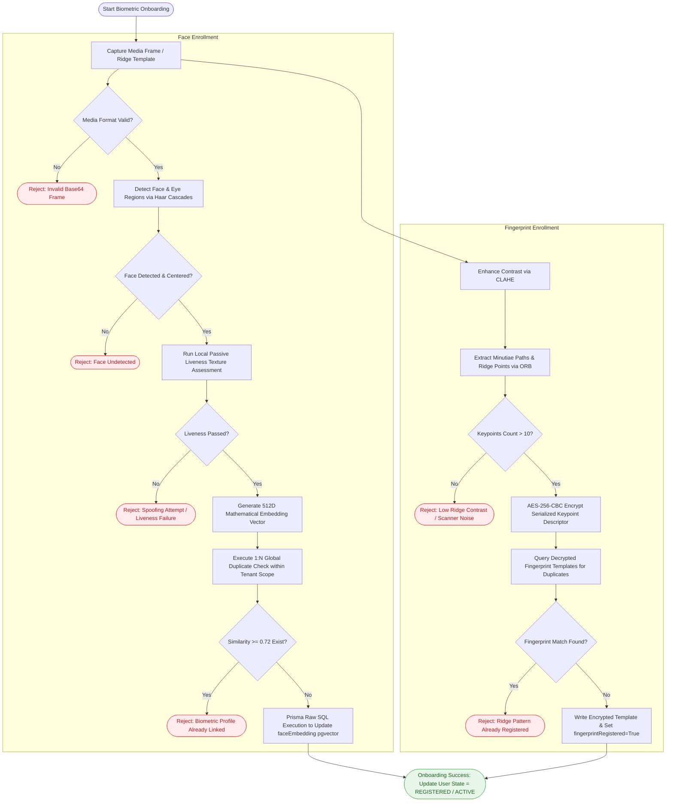
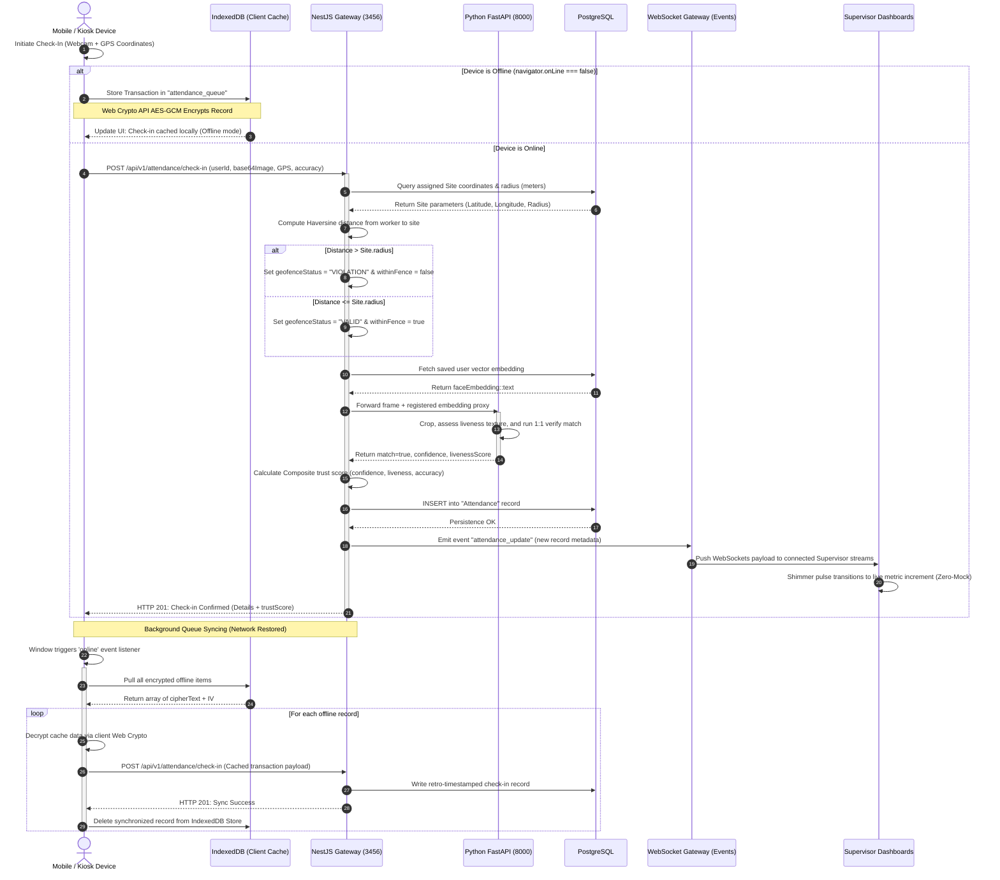
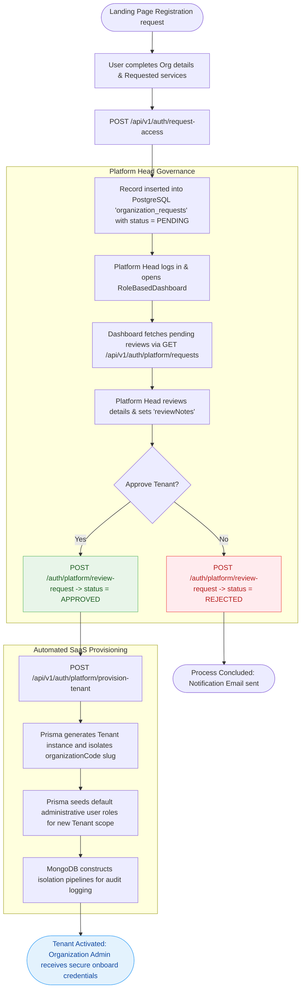
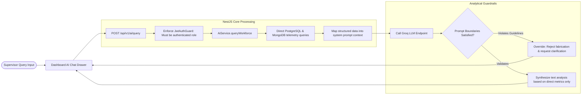

# FenceIN — Complete System Architecture & Data Flow

This document details the complete end-to-end system topology, component interactions, database schemas, and workflows governing the **FenceIN Enterprise Workforce Security & Biometric Attendance Platform**. It serves as the single source of truth for architectural structure, data lineages, security pipelines, and offline-first orchestration.

---

## 1. System Topology & Architectural Blueprint

The FenceIN ecosystem utilizes a split-service design consisting of a high-performance **FastAPI Biometrics Engine** (running on Port `8000`) for media operations, computer-vision inferences, and raw biometric validation, and a structured **NestJS API Gateway** (running on Port `3456`) for enterprise business logic, tenancy, RBAC authorization, and state storage.

---

## 2. Shared Identity & The RBAC Chain of Trust

Authentication flows through a rigorous zero-trust pipeline where identities verified through password hashes or computer-vision biometric scoring produce signed JWT keys containing organizational tenancy constraints. All downstream HTTP requests enforce Role-Based Access Control (RBAC) validations.

---

## 3. Biometric Enrollment Workflow (Face & Fingerprint)

Biometric onboarding enforces uniqueness within the organizational tenant context to prevent duplicate accounts and secure identity profiles.

---

## 4. Workforce Geofenced Attendance Lifecycle

The core operational flow verifies contractor/worker positions relative to allocated branch geofences, scores the biometric trust value, pushes real-time telemetry to dashboards, and handles network disruptions elegantly.

---

## 5. Platform Governance & Organization Onboarding Pipeline

For multi-tenant SaaS scaling, organization onboarding involves strict reviews, security audits, and automated isolation partitioning.

---

## 6. Zero-Mock AI Analytics & Assistant Engine

The system integrates a strict zero-mock analytical pipeline powered by **Groq LLM API** services to perform workforce queries and predictive insights.

---

## 7. Data Lineage & Storage Matrix

The persistence architecture is separated into a transactional layer (PostgreSQL) and an analytical/audit logging layer (MongoDB) to keep processing loops lean and optimized.

| Entity Domain | Primary Storage | Schema / Type | Query Engine / Connector | Security Strategy |
| :--- | :--- | :--- | :--- | :--- |
| **Users / Admins** | PostgreSQL | `users` Table | Prisma ORM / Client | Bcrypt password hash, Row-Level isolation |
| **Biometric Face Embeddings** | PostgreSQL | `faceEmbedding` 512D Vector | pgvector raw SQL cosine similarity (`<=>`) | Structured validation (variance check > 1e-4) |
| **Fingerprint Templates** | PostgreSQL | `fingerprintTemplate` | Prisma / Decrypted via AES-256-CBC | Scrypt derived encryption key from JWT_SECRET |
| **Geofenced Sites** | PostgreSQL | `Site` Table | Prisma / Haversine Geo Queries | Circular radius (meters), Lat-Long floating coordinates |
| **Workforce Attendance Logs**| PostgreSQL | `Attendance` Table | Prisma Client | Composite Trust Score validation (confidence + liveness) |
| **Administrative Audits** | MongoDB | `audit_logs` Collection | MongoService / Mongoose | Immutable append-only schema |
| **Inference & Telemetry** | MongoDB | `ai_inference_logs`, `telemetry` | MongoDB Client | Fire-and-forget async logs, no transaction block |
